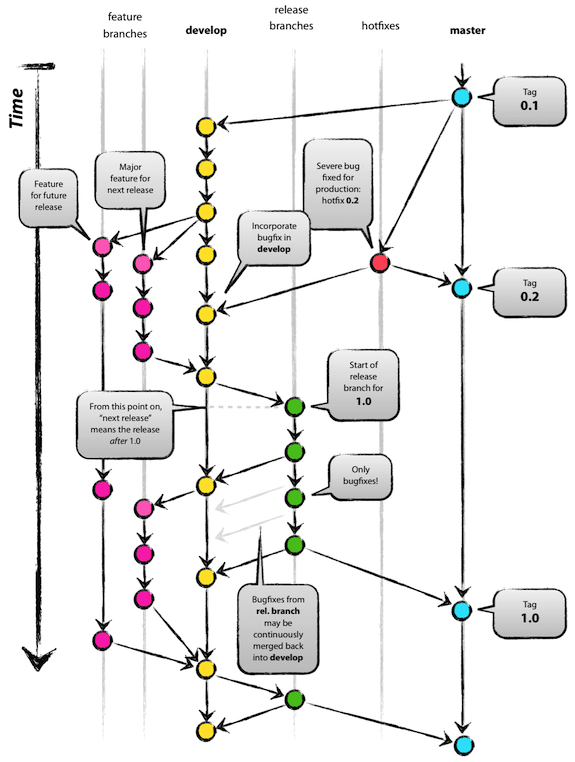

# release_mgmt_example
This repo is a demonstration of how to wire up automated release management using GitHub Actions.

## Tools

* [`semantic-release`][5] - Fully automated version management and package publishing
* [`semantic-release/commit-analyzer`][6] - [**semantic-release**](https://github.com/semantic-release/semantic-release) plugin to analyze commits with [conventional-changelog](https://github.com/conventional-changelog/conventional-changelog)
* [`semantic-release/release-notes-generator`][3] - [**semantic-release**](https://github.com/semantic-release/semantic-release) plugin to generate changelog content with [conventional-changelog](https://github.com/conventional-changelog/conventional-changelog)
* [`semantic-release/github`][7] - [**semantic-release**](https://github.com/semantic-release/semantic-release) plugin to publish a
[GitHub release](https://help.github.com/articles/about-releases) and comment on released Pull Requests/Issues.
* [`deepakputhraya/action-pr-title`][4] - Github action to enforce Pull Request title conventions


## Pipelines

[GitHub Actions][1] are used to run tests and drive automation.  Read
through the documentation for more usage information.

|Name|Description|
|--|--|
|[Release](.github/workflows/release.yml)|Runs the `semantic-release` process on merges to `main`|
|[PR Name Check](.github/workflows/pr-check.yml)|Enforces PR title conventions on any PR activity.|

### Configuration
|Name|Description|
|--|--|
|[`.releaserc`](.releaserc)|General **semantic-release** plugin [configuation][2]|
|[`semantic.yml`](.github/semantic.yml)|Enforces PR title conventions on any PR activity.|

[Workflow Configuration][8] examples to configure branching rules, releases, channels, version ranges, and more.  


## `Makefile` usage
The `Makefile` has a helper target to prepare a new release branch.  

```
$ make help
create-release-branch          Create release branch on main
```

----
# Repository Configuration

This repository is modeled after [GitFlow - A successful Git branching model][9]. Merging to `main` triggers the release processes.  The `dev` branch is configured as the **default** branch.  All feature work is merged into the `dev` branch.  Releases are generated by creating a `release-*` branch using the processed defined in the `create-release-branch` `Makefile` target.  Release branches generally track `dev` exactly, but it's possible to cherry-pick changes.  The overall process is meant to enable a release engineering function.

It's also worth noting that a [Branch Protection Rule][10] is configured on the `dev` branch which requires the **PR Name Check** action to succeed.  This is done to enforce the proper behavior of the **semantic-release** tooling.  




[1]: https://github.com/features/actions
[2]: https://github.com/semantic-release/semantic-release/blob/master/docs/usage/configuration.md#configuration
[3]: https://github.com/semantic-release/release-notes-generator
[4]: https://github.com/deepakputhraya/action-pr-title
[5]: https://semantic-release.gitbook.io/
[6]: https://github.com/semantic-release/commit-analyzer
[7]: https://github.com/semantic-release/github
[8]: https://github.com/semantic-release/semantic-release/blob/master/docs/usage/workflow-configuration.md#workflow-configuration
[9]: https://nvie.com/posts/a-successful-git-branching-model/
[10]: https://docs.github.com/en/github/administering-a-repository/defining-the-mergeability-of-pull-requests/about-protected-branches#require-status-checks-before-merging
